# Rota **/animes** método **POST**

### Entrada e saída **ROTA /animes método POST**.

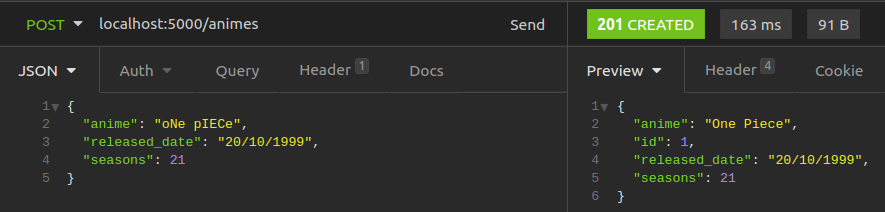

 

### Entrada e saída **ROTA /animes método POST** com **CHAVES INVÁLIDAS**.

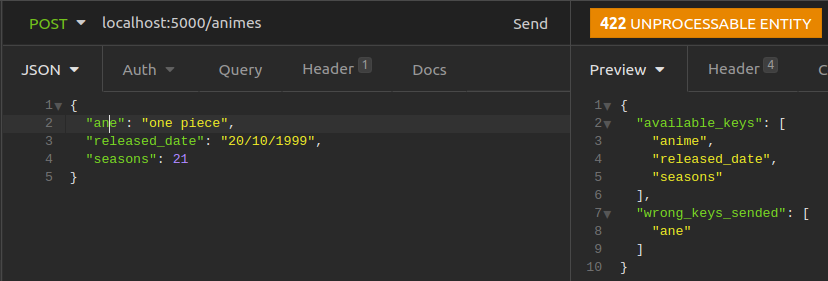

 

### Entrada e saída **ROTA /animes método POST ANIME JÁ EXISTE**.

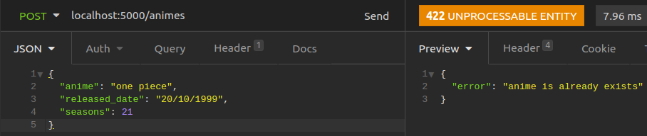

 
 

# Rota **/animes** método **GET**

### Entrada e saída **ROTA /animes método GET**.

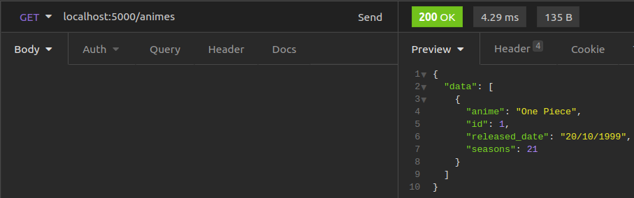

 

### Entrada e saída **ROTA /animes método GET** sem ter a **TABELA CRIADA** ou **TABELA VAZIA**.

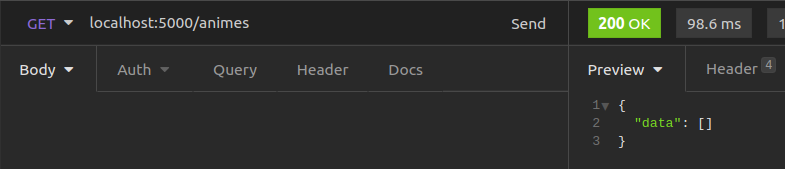

 
 

# Rota **/animes/\<int:anime_id>** método **GET**

### Entrada e saída **Rota /animes/\<int:anime_id> método GET**.

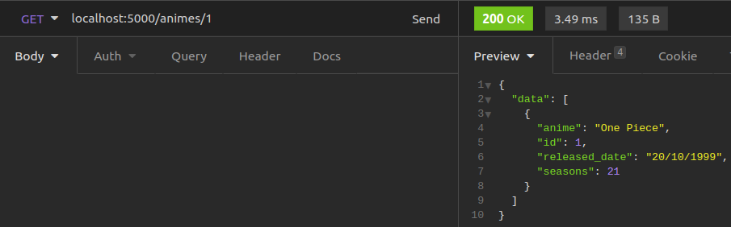

 

### Entrada e saída **ROTA /animes/\<int:anime_id> método GET** sem ter a **TABELA CRIADA** ou **NÃO EXISTA O ID**.

 
 

# Rota **/animes/\<int:anime_id>** método **PATCH**

### Entrada e saída **Rota /animes/\<int:anime_id> método PATCH**.

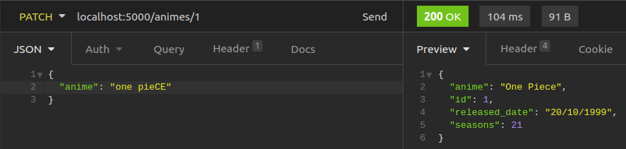

 

### Entrada e saída **Rota /animes/\<int:anime_id> método PATCH** com **CHAVES INVÁLIDAS**.

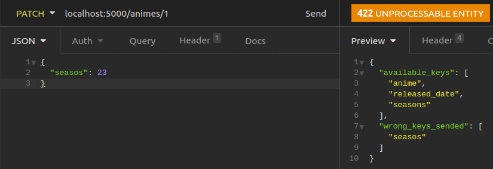

 

### Entrada e saída **ROTA /animes/\<int:anime_id> método PATCH** sem ter a **TABELA CRIADA** ou **NÃO EXISTA O ID**.

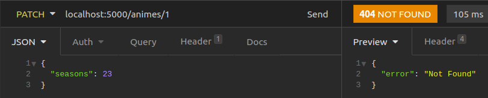

 
 

# Rota **/animes/\<int:anime_id>** método **DELETE**

### Entrada e saída **ROTA /animes/\<int:anime_id> método DELETE**.

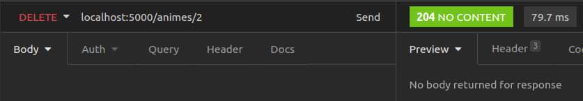

 

### Entrada e saída **ROTA /animes/\<int:anime_id> método DELETE** sem ter a **TABELA CRIADA** ou **NÃO EXISTA O ID**.

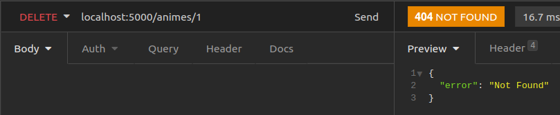

 
 
